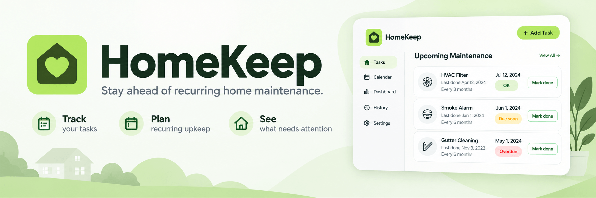
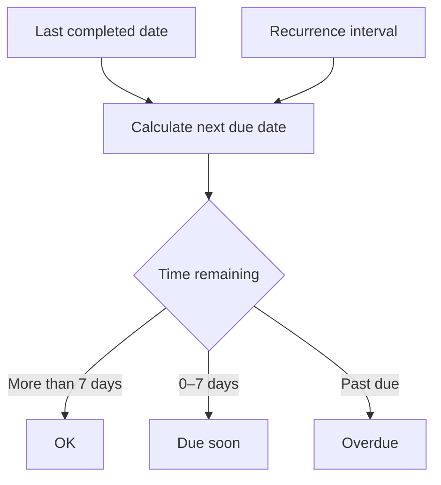

# 🏡 HomeKeep

**A simple way to stay ahead of recurring home maintenance.**



HomeKeep turns a task's last completion date and recurrence interval into a clear next due date, so homeowners can immediately see what is fine, what needs attention soon, and what is overdue.

[](https://astro.build/) [](https://react.dev/) [](https://www.typescriptlang.org/) [](https://tailwindcss.com/) [](https://supabase.com/) [](https://workers.cloudflare.com/)

## What HomeKeep does

Home maintenance is easy to postpone when dates live in memory, scattered notes, or unrelated calendar events. HomeKeep keeps the workflow deliberately small: save a recurring task once, then use its current status to decide what needs attention next.

For every task, HomeKeep shows:

- the maintenance task name;
- when it was last completed;
- how often it should recur;
- the calculated next due date;
- one current status: **OK**, **Due soon**, or **Overdue**.

Marking a task as completed updates its schedule and status, without requiring the task to be recreated.

## Core features

- 🔐 Email and password authentication
- 🏠 Private maintenance list for every homeowner
- ➕ Create recurring maintenance tasks
- ✏️ Edit existing tasks and recurrence settings
- ✅ Mark a task as completed
- 🗑️ Delete tasks that are no longer relevant
- 📅 Automatic next due date calculation
- 🚦 Clear status classification for quick scanning
- 📱 Responsive experience for modern desktop and mobile browsers

## Status rules

The next due date is calculated from the task's **last completed date** and **recurrence interval**. Each task always receives exactly one status.

| Status | Meaning |
| --- | --- |
| **OK** | The task is due in more than 7 days. |
| **Due soon** | The task is due within the next 7 days, including today. |
| **Overdue** | The next due date has passed. |



## MVP scope

HomeKeep focuses on the shortest useful maintenance workflow for an individual homeowner.

### Included

- account-based access;
- private task data;
- create, read, update, and delete operations;
- completion tracking;
- automatic due dates and statuses.

### Not included yet

- shared homes, household members, invitations, or roles;
- email, push, SMS, or calendar reminders;
- a prebuilt maintenance task library;
- AI-generated schedules or recommendations;
- maintenance history or recovery of deleted tasks.

## Tech stack

| Technology | Purpose |
| --- | --- |
| [Astro 6](https://astro.build/) | Server-first web framework and routing |
| [React 19](https://react.dev/) | Interactive UI components |
| [TypeScript 5](https://www.typescriptlang.org/) | Static typing and safer application code |
| [Tailwind CSS 4](https://tailwindcss.com/) | Styling and responsive layout |
| [Supabase](https://supabase.com/) | Authentication and persistent user data |
| [Cloudflare Workers](https://workers.cloudflare.com/) | Production runtime and deployment target |

## Getting started

### Prerequisites

- [Node.js](https://nodejs.org/) `22.14.0` (see `.nvmrc`)
- npm
- [Docker](https://www.docker.com/) with approximately 7 GB of available memory for local Supabase, or access to a hosted Supabase project

### 1. Install dependencies

```bash
npm install
```

### 2. Configure environment variables

Create the environment files from the provided example:

```bash
cp .env.example .env
cp .env.example .dev.vars
```

Both files require the following values:

| Variable | Description |
| --- | --- |
| `SUPABASE_URL` | URL of the local or hosted Supabase project |
| `SUPABASE_KEY` | Supabase anonymous public key |

These variables are declared through Astro's environment schema and are used server-side. Never commit real credentials.

### 3. Start Supabase locally

Initialize the local project once:

```bash
npx supabase init
```

Start the local Supabase stack:

```bash
npx supabase start
```

Copy the URL and anonymous key printed by the CLI into `.env` and `.dev.vars`:

```dotenv
SUPABASE_URL=http://127.0.0.1:54321
SUPABASE_KEY=<your-local-anon-key>
```

Supabase Studio is then available at [http://localhost:54323](http://localhost:54323).

To stop the local services:

```bash
npx supabase stop
```

> Prefer a hosted project? Use its project URL and anonymous key instead of starting the local stack.

### 4. Run HomeKeep

```bash
npm run dev
```

Open the local URL displayed in the terminal, create an account, and add your first maintenance task.

## Available commands

| Command | Description |
| --- | --- |
| `npm run dev` | Start the development server in the Cloudflare `workerd` runtime |
| `npm run build` | Create a production build |
| `npm run preview` | Preview the production build locally |
| `npm run lint` | Run ESLint with type-aware rules |
| `npm run lint:fix` | Automatically fix supported lint issues |
| `npm run format` | Format the codebase with Prettier |

## Project structure

```text
.
├── public/                 # Static assets
├── src/
│   ├── assets/             # Imported images and other bundled assets
│   ├── components/         # Astro and React UI components
│   ├── layouts/            # Shared page layouts
│   ├── pages/              # Application routes
│   │   └── api/            # Server API endpoints
│   └── middleware.ts       # Authentication and route protection
├── supabase/               # Local Supabase configuration and migrations
├── .env.example            # Environment variable template
└── wrangler.jsonc          # Cloudflare Workers configuration
```

## Authentication and data privacy

HomeKeep requires authentication. Every maintenance task belongs to one account, and signed-in users must only be able to read or modify their own records.

Authentication routes:

| Route | Purpose |
| --- | --- |
| `/auth/signin` | Sign in with email and password |
| `/auth/signup` | Create an account |
| `/auth/confirm-email` | Confirm that a verification email has been sent |
| `/dashboard` | View and manage the signed-in user's maintenance tasks |

Protected routes are enforced in `src/middleware.ts`. Database access rules should remain consistent with the same ownership boundary.

### Email confirmation during local development

Supabase may require email confirmation before a new account can sign in. To shorten the local feedback loop, disable **Confirm email** in Supabase Studio under **Authentication → Providers → Email**. Keep confirmation enabled in production unless the project has a deliberate alternative verification flow.

## Deployment

HomeKeep targets Cloudflare Workers.

1. Build and verify the application:

```bash
npm run lint
npm run build
```

2. Add `SUPABASE_URL` and `SUPABASE_KEY` to the Cloudflare project environment.

3. Deploy with Wrangler:

```bash
npx wrangler deploy
```

Do not reuse local Supabase credentials in production. Configure the production site URL and allowed redirect URLs in Supabase Authentication settings before accepting users.

## Continuous integration

GitHub Actions runs linting and a production build on pushes and pull requests to `master`. Add `SUPABASE_URL` and `SUPABASE_KEY` as repository secrets so the build can validate environment-dependent code.

## Contributing

Before opening a pull request:

```bash
npm run format
npm run lint
npm run build
```

Keep changes within HomeKeep's focused product model: recurring maintenance tasks, clear due dates, and private user data. If a change expands the MVP scope, describe the user problem it solves and the added complexity in the pull request.

## License

This project is licensed under the MIT License.
