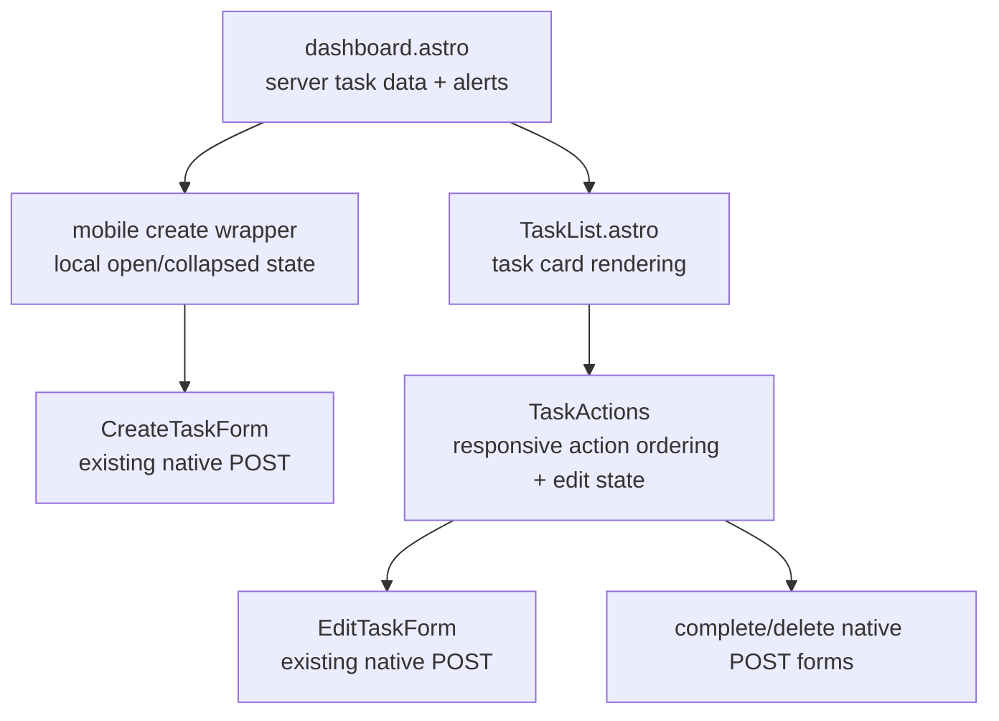

# Dashboard Mobile UX Improvements Implementation Plan

## Overview

Polish the HomeKeep dashboard for mobile use after the S-05 task-form work. The slice keeps the MVP data and route contracts unchanged while improving the mobile flow around task scanning, task creation entry, and task actions.

The target behavior is deliberately narrow: when tasks exist on mobile, users should see a compact create entry first with the create form hidden until opened, keeping saved tasks immediately reachable; when no tasks exist, the create form should remain visible. On desktop, the create form should remain visible in all task states. Task action buttons should appear on mobile in the order Mark completed, Delete, Edit task.

## Current State Analysis

The current S-05 baseline is already close to the desired architecture:

- `src/pages/dashboard.astro` fetches account-scoped tasks server-side, renders route-level alerts, and composes the create card before `TaskList` in a responsive grid.
- `src/pages/dashboard.astro` renders `<CreateTaskForm client:load />`, so create-form behavior that depends on browser interaction already lives in a hydrated React island.
- `src/components/tasks/TaskList.astro` renders task cards and delegates action controls to `<TaskActions task={task} client:load />`.
- `src/components/tasks/TaskActions.tsx` owns local edit-panel state, native POST forms for delete and mark-completed, and the current action layout: edit/delete grouped first and mark-completed on the right at `sm` and above.
- `src/components/tasks/CreateTaskForm.tsx` posts to `/api/tasks/create` and already uses the shared S-05 form validation and presets.
- There is no existing reusable collapsible/disclosure primitive under `src/components/ui/`; adding a local task-create wrapper is lower risk than introducing a new UI primitive for one slice.
- Existing dashboard banners should remain unchanged for this slice based on the planning decision.

## Decisions

| Decision | Choice | Source |
| --- | --- | --- |
| Complexity | Medium; seven planning questions | Plan interview |
| Mobile creation | Keep the create entry first but collapse the form on mobile only when there are saved tasks | Plan interview |
| Empty and desktop states | Keep create form visible/uncollapsed when there are no tasks and on desktop in all states | Plan interview |
| Task card density | No task-card content/density redesign | Plan interview |
| Mobile action order | Mark completed, Delete, Edit task | Roadmap / Plan interview |
| Desktop action layout | Desktop may keep a layout optimized for wider scanning | Roadmap / Plan interview |
| Breakpoint | Apply mobile-specific behavior below `sm` | Plan interview |
| Banners | Keep current dashboard banners unchanged | Plan interview |
| Verification | Lint, build, focused searches, and manual visual checks | Plan interview |

## Scope

### In Scope

- Mobile-only create-form disclosure when tasks exist, with the create entry remaining before the task list.
- Create form visible by default when there are no saved tasks and on desktop in all states.
- A clear mobile add/create trigger that opens the existing `CreateTaskForm`.
- Mobile task action order: Mark completed, Delete, Edit task.
- Preserve existing desktop ergonomics where useful.
- Preserve existing create, edit, complete, delete, and dashboard alert routes.
- Responsive checks for mobile and desktop in light and dark themes.

### Out of Scope

- Supabase schema changes, migrations, or data access changes.
- Any change to task due-date/status calculation.
- Any API route changes for create, update, complete, or delete.
- Dashboard banner copy, placement, or routing behavior changes.
- Task card information-density redesign.
- New shadcn primitive installation unless implementation proves the local wrapper is inadequate.
- S-07 app shell, homepage, auth-page, or global navigation work.

## Architecture Approach

Keep the dashboard composition server-rendered in Astro and use small hydrated React islands for interactive UI state:

The implementation should not move task data fetching into React. It should keep POST forms native, preserve the current API contracts, and adjust only layout/state needed for mobile UX.

## Phase 1: Mobile Create Entry

Make task creation compact on mobile when tasks exist, without moving the create entry or hiding the first-task path.

### Changes Required:

#### 1. Create Form Wrapper

**File**: `src/components/tasks/CreateTaskPanel.tsx` or equivalent

**Intent**: Add a small hydrated wrapper around the existing `CreateTaskForm` so the dashboard can collapse the form body on mobile when there are saved tasks while keeping a predictable create entry point.

**Contract**: Accept a boolean prop such as `hasTasks`. When `hasTasks` is false, render the create form visible by default on every viewport. When `hasTasks` is true, render an obvious mobile create trigger below `sm` before the task list and hide the form body until opened; keep the form visible at `sm` and above. The wrapper must reuse `CreateTaskForm`; it must not duplicate form fields or POST logic.

#### 2. Dashboard Composition

**File**: `src/pages/dashboard.astro`

**Intent**: Wire the create wrapper into the existing dashboard without moving task fetching or alert logic.

**Contract**: Continue to render route-level alerts exactly as today. Replace the direct `<CreateTaskForm client:load />` usage with the new wrapper island, passing whether `tasks.length > 0`. Preserve the current create-before-list composition, but make the mobile create surface compact/collapsed when tasks exist and keep the desktop grid relationship between the create surface and task list.

#### 3. Empty State Interaction

**File**: `src/pages/dashboard.astro`, `src/components/tasks/CreateTaskPanel.tsx`

**Intent**: Ensure first-time mobile users are not asked to discover a hidden create panel while the list is empty.

**Contract**: With `tasks.length === 0`, the create form is visible on mobile and desktop. The existing task-list empty state may remain, but it must not be the only path to task creation.

### Success Criteria:

#### Automated Verification:

- `npm run lint` passes.
- `rg -n "CreateTaskForm client:load" src/pages/dashboard.astro` returns no direct dashboard usage because the wrapper owns hydration.
- The new create wrapper imports and renders `CreateTaskForm`; it does not duplicate `name`, `lastCompletedDate`, or `recurrenceIntervalDays` inputs.

#### Manual Verification:

- On a mobile viewport with at least one task, an obvious compact create trigger appears before the task list, the create form body is hidden until opened, and saved tasks remain immediately reachable.
- On a mobile viewport with no tasks, the create form is visible without first opening a trigger.
- On desktop, the create form remains visible in the dashboard layout.
- Dashboard success/error banners appear as they did before this slice.

## Phase 2: Mobile Task Action Ordering

Adjust task actions for mobile order without regressing native task actions.

### Changes Required:

#### 1. Responsive Action Order

**File**: `src/components/tasks/TaskActions.tsx`

**Intent**: Make mobile action order match the S-06 contract: Mark completed, Delete, Edit task.

**Contract**: Below `sm`, render or order visible buttons as Mark completed, Delete, Edit task. At `sm` and above, the component may keep the current wide layout if it remains clearer. Preserve the existing button labels unless a label is too long for mobile; any label shortening must remain understandable and accessible.

#### 2. Preserve Native Forms

**File**: `src/components/tasks/TaskActions.tsx`

**Intent**: Avoid regressing task mutations while changing layout.

**Contract**: Mark-completed still posts to `/api/tasks/complete` with hidden `taskId`. Delete still posts to `/api/tasks/delete` with hidden `taskId` and keeps confirmation behavior. Edit still toggles the existing `EditTaskForm` without changing its POST target.

#### 3. Edit Panel Placement

**File**: `src/components/tasks/TaskActions.tsx`

**Intent**: Keep edit behavior understandable even though the edit trigger moves later in mobile order.

**Contract**: Activating Edit task still reveals the edit form below the action row. The edit panel keeps a stable `aria-controls` relationship and does not overlap or reorder task card content unpredictably.

### Success Criteria:

#### Automated Verification:

- `npm run lint` passes.
- `npm run build` passes.
- `rg -n 'action="/api/tasks/(complete|delete)"|action="/api/tasks/update"' src/components/tasks` confirms existing task action routes are still present.
- `rg -n 'Mark completed|Delete|Edit task' src/components/tasks/TaskActions.tsx` confirms all three task action labels remain available.

#### Manual Verification:

- On mobile, each task card shows actions in this order: Mark completed, Delete, Edit task.
- On desktop, task actions remain visually clear and do not need to match the mobile order.
- Delete cancellation prevents the delete POST.
- Mark completed still updates the task after redirect.
- Edit task still opens the edit form and saving changes still updates the task after redirect.

## Phase 3: Responsive QA and Polish Guardrails

Verify that the mobile changes integrate cleanly with the existing S-05 dashboard.

### Changes Required:

#### 1. Visual Guardrails

**File**: `src/pages/dashboard.astro`, `src/components/tasks/*.tsx`, `src/components/tasks/*.astro`

**Intent**: Keep S-06 aligned with the F-02 Luma/Lime UI foundation.

**Contract**: Use existing `src/components/ui/*` primitives and semantic token classes. Do not introduce raw old palette utilities such as `bg-cosmic`, `purple-*`, `blue-*`, `slate-*`, `emerald-*`, `rose-*`, `amber-*`, `sky-*`, or `text-white` in touched app UI files.

#### 2. No Banner Scope Creep

**File**: `src/pages/dashboard.astro`

**Intent**: Respect the planning decision that banners stay as they are in S-06.

**Contract**: Do not change `taskCreated`, `taskCompleted`, `taskDeleted`, `taskUpdated`, `taskError`, or `dashboardError` copy/placement in this slice except for mechanical movement that is required by layout and preserves behavior.

#### 3. Browser Verification Notes

**File**: `context/changes/dashboard-mobile-ux-improvements/plan.md`

**Intent**: Leave objective manual checks for implementation status.

**Contract**: Progress rows must be marked only in the `## Progress` section. Manual verification should include mobile and desktop checks in light and dark themes.

### Success Criteria:

#### Automated Verification:

- `npm run lint` passes.
- `npm run build` passes.
- `rg -n "bg-cosmic|purple-|blue-|slate-|emerald-|rose-|amber-|sky-|text-white" src/pages/dashboard.astro src/components/tasks` returns no matches.
- `rg -n "TaskActions.*client:load|CreateTaskPanel.*client:load|CreateTaskForm client:load" src/pages/dashboard.astro src/components/tasks` confirms hydrated islands are still in the expected places.

#### Manual Verification:

- Mobile viewport with tasks: compact create trigger appears first, create form body is collapsed, and saved tasks remain immediately reachable.
- Mobile viewport without tasks: create form is visible immediately.
- Mobile task actions follow Mark completed, Delete, Edit task.
- Desktop dashboard still shows a usable create surface and task list without awkward spacing.
- Light and dark themes render the create trigger, task actions, and edit panel clearly.

## Testing Strategy

### Automated

- Run `npm run lint` after each phase that touches Astro/React.
- Run `npm run build` after Phase 2 and Phase 3 because responsive Astro/React integration can fail at build time.
- Use focused `rg` checks for prohibited palette classes, route preservation, and hydration placement.

### Manual

- Use a mobile viewport below `sm` and a desktop viewport above `sm`.
- Check both empty and non-empty task states.
- Check task actions after S-06 ordering changes: mark completed, delete cancel/confirm, edit open/save.
- Check light and dark themes for visual clarity.

## Risks and Mitigations

- **Risk:** Collapsing create hides an important workflow. **Mitigation:** Collapse only when tasks exist; keep create visible when there are no tasks.
- **Risk:** Mobile action ordering makes delete too prominent. **Mitigation:** Keep destructive styling and confirmation behavior; verify cancel prevents POST.
- **Risk:** Different mobile and desktop action orders become confusing. **Mitigation:** Apply the difference only below `sm`, where the roadmap explicitly prioritizes mobile ergonomics.
- **Risk:** A create wrapper duplicates S-05 form logic. **Mitigation:** Wrapper owns only disclosure state and renders `CreateTaskForm` unchanged.
- **Risk:** Banner scope expands into copy redesign. **Mitigation:** Banners are explicitly out of scope for this slice.

## Rollback Plan

- If create collapse causes usability issues, keep the wrapper but default it open for all states while preserving the task-list-first layout work for a future iteration.
- If responsive action ordering breaks task actions, revert `TaskActions.tsx` layout changes while keeping Phase 1 create-entry changes.
- If build or hydration fails, remove the new wrapper island and fall back to direct `CreateTaskForm client:load` until the React integration issue is isolated.

## Progress

> Convention: `- [ ]` pending, `- [x]` done. Append ` - <commit sha>` when a step lands. Do not rename step titles.

### Phase 1: Mobile Create Entry

#### Automated

- [x] 1.1 `npm run lint` passes.
- [x] 1.2 `rg -n "CreateTaskForm client:load" src/pages/dashboard.astro` returns no direct dashboard usage because the wrapper owns hydration.
- [x] 1.3 The new create wrapper imports and renders `CreateTaskForm`; it does not duplicate `name`, `lastCompletedDate`, or `recurrenceIntervalDays` inputs.

#### Manual

- [x] 1.4 On a mobile viewport with at least one task, an obvious compact create trigger appears before the task list, the create form body is hidden until opened, and saved tasks remain immediately reachable.
- [x] 1.5 On a mobile viewport with no tasks, the create form is visible without first opening a trigger.
- [x] 1.6 On desktop, the create form remains visible in the dashboard layout.
- [x] 1.7 Dashboard success/error banners appear as they did before this slice.

### Phase 2: Mobile Task Action Ordering

#### Automated

- [ ] 2.1 `npm run lint` passes.
- [ ] 2.2 `npm run build` passes.
- [ ] 2.3 `rg -n 'action="/api/tasks/(complete|delete)"|action="/api/tasks/update"' src/components/tasks` confirms existing task action routes are still present.
- [ ] 2.4 `rg -n 'Mark completed|Delete|Edit task' src/components/tasks/TaskActions.tsx` confirms all three task action labels remain available.

#### Manual

- [ ] 2.5 On mobile, each task card shows actions in this order: Mark completed, Delete, Edit task.
- [ ] 2.6 On desktop, task actions remain visually clear and do not need to match the mobile order.
- [ ] 2.7 Delete cancellation prevents the delete POST.
- [ ] 2.8 Mark completed still updates the task after redirect.
- [ ] 2.9 Edit task still opens the edit form and saving changes still updates the task after redirect.

### Phase 3: Responsive QA and Polish Guardrails

#### Automated

- [ ] 3.1 `npm run lint` passes.
- [ ] 3.2 `npm run build` passes.
- [ ] 3.3 `rg -n "bg-cosmic|purple-|blue-|slate-|emerald-|rose-|amber-|sky-|text-white" src/pages/dashboard.astro src/components/tasks` returns no matches.
- [ ] 3.4 `rg -n "TaskActions.*client:load|CreateTaskPanel.*client:load|CreateTaskForm client:load" src/pages/dashboard.astro src/components/tasks` confirms hydrated islands are still in the expected places.

#### Manual

- [ ] 3.5 Mobile viewport with tasks: compact create trigger appears first, create form body is collapsed, and saved tasks remain immediately reachable.
- [ ] 3.6 Mobile viewport without tasks: create form is visible immediately.
- [ ] 3.7 Mobile task actions follow Mark completed, Delete, Edit task.
- [ ] 3.8 Desktop dashboard still shows a usable create surface and task list without awkward spacing.
- [ ] 3.9 Light and dark themes render the create trigger, task actions, and edit panel clearly.
