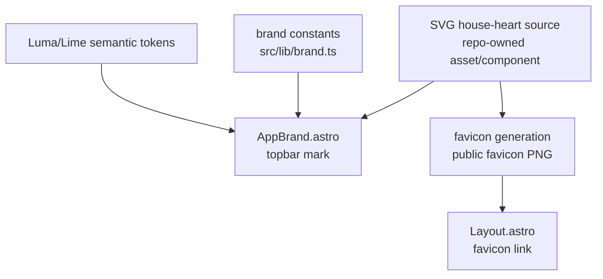

# HomeKeep Visual Identity Assets Implementation Plan

## Overview

Add a lightweight HomeKeep visual identity based on a house-heart mark while preserving the existing shadcn/Base UI Luma/Lime foundation. The implementation should replace the temporary `HK` chip in the topbar, update browser favicon assets, and keep the current HomeKeep name/tagline lockup structure.

This is an asset and presentation slice only. It must not change task CRUD, auth routing, shell behavior, maintenance calculations, data access, or README/template imagery.

## Current State Analysis

S-08 is already scoped by the roadmap as a narrow identity slice:

- `context/foundation/roadmap.md:46` defines MS-08: add a lightweight identity based on the house-heart mark and favicon, with no README/template image work.
- `context/foundation/roadmap.md:73` lists `homekeep-visual-identity-assets` as S-08 with outcome "see lightweight HomeKeep identity and favicon based on the house-heart mark".
- `context/foundation/roadmap.md:217` through `context/foundation/roadmap.md:225` keep the risk focused on avoiding brand-collateral scope creep.
- `context/foundation/tech-stack.md` defines the UI baseline as shadcn/ui, Base UI, Luma preset, Lime theme, Tailwind v4 CSS variables, and Lucide icons.

The current codebase has the hooks needed for a small implementation:

- `components.json:3` uses `base-luma`, `components.json:8` points at `src/styles/global.css`, and `components.json:20` keeps Lucide as the icon library.
- `src/lib/brand.ts:1` through `src/lib/brand.ts:4` centralize app name, title, and tagline constants.
- `src/components/brand/AppBrand.astro:13` through `src/components/brand/AppBrand.astro:20` renders the current brand surface: an `HK` text chip plus HomeKeep name and optional tagline.
- `src/layouts/Layout.astro:36` links `/favicon.png` as a PNG favicon.
- The `public/` directory currently contains `favicon.png` as a 32x32 PNG and `template.png`; `template.png` is starter/README collateral and remains out of scope.

Nearby plans constrain overlap:

- F-02 already delivered the design-system foundation and identity hooks; S-08 should use those hooks instead of creating a new UI foundation.
- S-07 owns app-shell/homepage/auth flow consistency and explicitly leaves final logo/favicon identity work to S-08.
- S-06 owns dashboard mobile ergonomics; S-08 should not change task layout or action order.

## Decisions

| Decision | Choice | Source |
| --- | --- | --- |
| Complexity | Low; five focused planning questions | Plan interview |
| Mark source | Repo-native SVG/CSS house-heart mark | Plan interview |
| Asset formats | Reusable SVG mark plus generated PNG favicon | Plan interview |
| Application surfaces | Topbar brand mark and browser favicon only | Plan interview |
| Text lockup | Refine the current name/tagline lockup; replace the `HK` chip | Plan interview |
| Visual QA | Require manual design review in addition to automated checks | Plan interview |
| README/template images | Excluded | Roadmap |
| UI foundation | Reuse shadcn/Base UI Luma/Lime tokens and existing brand hooks | Roadmap / Tech stack |

## Scope

### In Scope

- Add a reusable repo-native SVG house-heart mark component or asset.
- Replace the current `HK` text chip in `src/components/brand/AppBrand.astro` with the new mark.
- Preserve the current topbar lockup structure: mark, HomeKeep name, and optional tagline controlled by `compact`.
- Add or update public favicon assets derived from the same mark.
- Update `src/layouts/Layout.astro` only as needed to point at the chosen favicon asset contract.
- Keep all styling on semantic Luma/Lime tokens from `src/styles/global.css`.
- Add small asset-generation or verification tooling only if needed to produce deterministic PNG favicon output.
- Verify mark legibility at favicon size and in topbar at mobile and desktop widths.

### Out of Scope

- README image or `public/template.png` replacement.
- Full brand guidelines, social preview images, marketing collateral, app-store icon sets, or presentation assets.
- Homepage hero redesign, auth page redesign, dashboard mobile layout changes, or new navigation behavior.
- Task CRUD, recurrence logic, Supabase schema, auth middleware, API routes, or data access changes.
- New shared households, reminders, task libraries, AI recommendations, or other PRD non-goals.
- Automatic dependency fixes such as `npm audit fix`.

## Architecture Approach

Keep identity centralized around the existing brand hooks. The new mark should be authored once and consumed by `AppBrand` and favicon generation, so the browser tab and in-app topbar share one visual source. Use SVG for maintainability and crisp scaling; generate the PNG favicon from that source rather than manually maintaining unrelated bitmap artwork.

## Phase 1: Mark Source and Asset Contract

Create the canonical identity source and make the favicon output deterministic.

### Changes Required:

#### 1. Canonical House-Heart Mark

**File**: new `src/components/brand/HomeKeepMark.astro` or equivalent repo-native SVG asset under `src/components/brand/`

**Intent**: Define one accessible, maintainable house-heart mark that can replace the placeholder `HK` chip without importing image files into every UI surface.

**Contract**: The mark must be an inline SVG or Astro component with a stable square viewBox, no raster dependency, and token-friendly colors. It should be decorative when used inside the existing `AppBrand` link because the adjacent HomeKeep text provides the accessible name.

#### 2. Public Favicon Assets

**File**: `public/favicon.svg`, `public/favicon.png`, optionally a small script or documented command under the change plan if generation needs one

**Intent**: Produce browser favicon assets from the same house-heart visual source.

**Contract**: Add an SVG favicon source and update the 32x32 PNG favicon. The PNG must remain small enough for browser use and visually recognizable at 16x16 and 32x32. Do not modify `public/template.png`.

#### 3. Favicon Link Contract

**File**: `src/layouts/Layout.astro`

**Intent**: Prefer the scalable SVG favicon while preserving PNG fallback behavior where practical.

**Contract**: Keep the existing page title behavior through `HOMEKEEP_BRAND`. Add or update `<link rel="icon">` tags so the SVG favicon is the primary asset and the PNG favicon remains available as a fallback if included.

### Success Criteria:

#### Automated Verification:

- `public/favicon.svg` exists and contains an SVG root with a square viewBox.
- `public/favicon.png` exists and is 32x32.
- `npm run lint` passes after adding the mark source and favicon links.

#### Manual Verification:

- The house-heart mark is recognizable at favicon size in light and dark browser chrome where the browser supports it.
- The favicon and app mark clearly look related because they use the same shape language.
- `public/template.png` remains unchanged.

## Phase 2: Topbar Lockup Integration

Replace the temporary in-app mark while preserving the current navigation structure.

### Changes Required:

#### 1. AppBrand Mark Replacement

**File**: `src/components/brand/AppBrand.astro`

**Intent**: Replace the current `HK` text chip with the new house-heart mark while keeping the brand link stable.

**Contract**: Preserve the root `<a href="/">` behavior, the `compact` prop, the HomeKeep name, and the optional tagline rendering. The new mark should have stable dimensions matching the current topbar rhythm and should not rely on visible explanatory text.

#### 2. Lockup Spacing and Responsive Fit

**File**: `src/components/brand/AppBrand.astro`

**Intent**: Refine spacing only enough to make the new mark feel intentional beside the existing text lockup.

**Contract**: Keep the topbar height stable. The mark/name/tagline must not overlap, wrap awkwardly, or resize the header on mobile or desktop. Use semantic token classes and avoid prohibited old palette utilities.

#### 3. Brand Constants Check

**File**: `src/lib/brand.ts`

**Intent**: Confirm the text lockup still uses the central brand constants and does not introduce duplicated app-name or tagline strings.

**Contract**: Keep `name`, `title`, and `tagline` as the single source for visible brand text unless implementation identifies a clear need for one additional asset-specific label.

### Success Criteria:

#### Automated Verification:

- `npm run lint` passes.
- `rg -n ">HK<|HK" src/components/brand src/layouts src/pages` returns no remaining user-facing placeholder mark usage.
- `rg -n "bg-cosmic|purple-|blue-|slate-|emerald-|rose-|amber-|sky-|text-white" src/components/brand src/layouts` returns no prohibited palette regressions in touched UI files.

#### Manual Verification:

- Topbar mark, name, and tagline render cleanly on mobile and desktop.
- The current compact behavior still hides the tagline when `compact` is true.
- The mark is legible in light and dark themes.

## Phase 3: Visual QA and Review

Verify the new identity assets in the running app before marking the slice complete.

### Changes Required:

#### 1. Browser Verification

**File**: no production file unless a visual defect requires adjustment

**Intent**: Check the mark in the real app context rather than relying only on static asset files.

**Contract**: Start the app with the standard local dev command or otherwise use the current browser verification setup. Check desktop and mobile widths in light and dark themes. Capture screenshots if available in the environment.

#### 2. Manual Design Review Gate

**File**: `context/changes/homekeep-visual-identity-assets/plan.md`

**Intent**: Honor the planning decision that final visual acceptance requires human review.

**Contract**: Automated checks can complete without manual approval, but the manual design-review Progress row remains unchecked until the user explicitly accepts the mark and favicon direction.

#### 3. Progress Notes

**File**: `context/changes/homekeep-visual-identity-assets/plan.md`

**Intent**: Keep the implementation status auditable.

**Contract**: Progress checkboxes are updated only in the `## Progress` section. When commits are created, append the short commit SHA to completed items.

### Success Criteria:

#### Automated Verification:

- `npm run lint` passes.
- `npm run build` passes.
- File checks confirm `public/favicon.svg` and 32x32 `public/favicon.png` are present.

#### Manual Verification:

- Desktop light and dark screenshots show a polished, non-overlapping topbar brand lockup.
- Mobile light and dark screenshots show the mark and text fit without shrinking or layout shift.
- User explicitly approves the house-heart mark and favicon direction.

## Testing Strategy

### Automated

- Run `npm run lint` after Phases 1 and 2.
- Run `npm run build` after Phase 3 because layout and public assets are involved.
- Use `rg` checks for placeholder `HK` usage and prohibited palette regressions.
- Check PNG dimensions through a deterministic local command before completion.

### Manual

- Review favicon at browser-tab scale and in direct image preview.
- Review topbar at mobile and desktop widths.
- Review light and dark theme rendering.
- Ask for explicit user approval of the mark and favicon before closing manual verification.

## Risks and Mitigations

- **Risk:** The SVG mark looks good in the topbar but fails at favicon size. **Mitigation:** Use simple geometry, verify at 16x16 and 32x32, and keep a generated PNG fallback.
- **Risk:** The slice expands into broad branding work. **Mitigation:** Apply the mark only to topbar and favicon; leave README/template/social/app-store collateral out of scope.
- **Risk:** The new mark clashes with Luma/Lime tokens. **Mitigation:** Use semantic token classes in app UI and keep the favicon shape simple enough to work independently.
- **Risk:** Generated PNG output is not reproducible. **Mitigation:** Prefer a deterministic local generation command or document the exact tool used in implementation notes.
- **Risk:** Visual acceptance is subjective. **Mitigation:** Treat user approval as a manual verification gate rather than trying to encode taste in automated tests.

## Rollback Plan

- Revert `AppBrand` to the previous mark container if the new topbar mark causes layout issues.
- Revert `Layout.astro` favicon link changes if a browser compatibility issue appears.
- Restore the previous `public/favicon.png` from git if the favicon direction is rejected.
- Keep any standalone SVG source only if it remains useful for a revised mark; otherwise revert it with the rejected favicon changes.

## Progress

> Convention: `- [ ]` pending, `- [x]` done. Append ` - <commit sha>` when a step lands. Do not rename step titles.

### Phase 1: Mark Source and Asset Contract

#### Automated

- [x] 1.1 `public/favicon.svg` exists and contains an SVG root with a square viewBox. - 6e13119
- [x] 1.2 `public/favicon.png` exists and is 32x32. - 6e13119
- [x] 1.3 `npm run lint` passes after adding the mark source and favicon links. - 6e13119

#### Manual

- [x] 1.4 The house-heart mark is recognizable at favicon size in light and dark browser chrome where the browser supports it. - 6e13119
- [x] 1.5 The favicon and app mark clearly look related because they use the same shape language. - 6e13119
- [x] 1.6 `public/template.png` remains unchanged. - 6e13119

### Phase 2: Topbar Lockup Integration

#### Automated

- [x] 2.1 `npm run lint` passes.
- [x] 2.2 `rg -n ">HK<|HK" src/components/brand src/layouts src/pages` returns no remaining user-facing placeholder mark usage.
- [x] 2.3 `rg -n "bg-cosmic|purple-|blue-|slate-|emerald-|rose-|amber-|sky-|text-white" src/components/brand src/layouts` returns no prohibited palette regressions in touched UI files.

#### Manual

- [x] 2.4 Topbar mark, name, and tagline render cleanly on mobile and desktop.
- [x] 2.5 The current compact behavior still hides the tagline when `compact` is true.
- [x] 2.6 The mark is legible in light and dark themes.

### Phase 3: Visual QA and Review

#### Automated

- [ ] 3.1 `npm run lint` passes.
- [ ] 3.2 `npm run build` passes.
- [ ] 3.3 File checks confirm `public/favicon.svg` and 32x32 `public/favicon.png` are present.

#### Manual

- [ ] 3.4 Desktop light and dark screenshots show a polished, non-overlapping topbar brand lockup.
- [ ] 3.5 Mobile light and dark screenshots show the mark and text fit without shrinking or layout shift.
- [ ] 3.6 User explicitly approves the house-heart mark and favicon direction.
