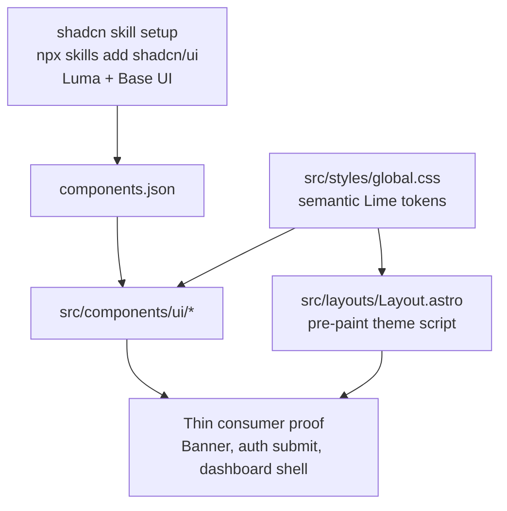

# shadcn/Luma Design-System Foundation Implementation Plan

## Overview

Establish the HomeKeep UI foundation for M-2 polish without turning F-02 into a full redesign. The implementation will align shadcn setup around Luma with Base UI selected as the base target, formalize Lime-oriented light/dark/system theme handling, add the small primitive set needed by downstream slices, and prove the foundation through thin adoption in existing layout/banner/auth/dashboard surfaces.

## Current State Analysis

HomeKeep already has a partial shadcn-ready foundation:

- `components.json` exists with TSX, CSS variables, aliases, neutral base color, and Lucide icons, but still uses `style: "new-york"` (`components.json:3`, `components.json:20`).
- Tailwind v4 uses `src/styles/global.css` as the token source; it already defines `:root`, `.dark`, `@theme inline`, and base styles (`src/styles/global.css:1`, `src/styles/global.css:6`, `src/styles/global.css:41`, `src/styles/global.css:75`).
- The repo has the expected shadcn support dependencies and one shadcn-style primitive: `Button` with CVA, Radix Slot, `cn()`, and Lucide-compatible icon sizing (`package.json:21`, `src/components/ui/button.tsx:7`).
- The visual language is inconsistent: dashboard uses one-off slate/emerald utilities (`src/pages/dashboard.astro:34`), auth pages use purple glass/cosmic styling (`src/pages/auth/signin.astro:9`), the starter homepage still says `10x Astro Starter` (`src/components/Welcome.astro:38`), and config banners are standalone CSS (`src/components/Banner.astro:1`).
- Task flows are server-authoritative POST/redirect/reload flows. F-02 must not change recurrence logic, ownership rules, task route behavior, or the MVP data model.

## Decisions

| Decision | Choice | Source |
| --- | --- | --- |
| Complexity | Medium; six focused questions, three implementation phases | Plan interview |
| Skill install command | Use `npx skills add shadcn/ui`, not the pnpm command from upstream docs | User |
| shadcn base target | Select Base UI as the base during shadcn skill/config setup | User |
| Registry strategy | Minimal registry use; install/adapt only primitives needed by the foundation | Plan interview |
| Theme behavior | Light/dark/system with system as first-run default | Plan interview |
| Primitive set | Core set: input, label/field, badge, alert, card/surface, spinner, theme toggle; skeleton only if a real proof surface exists | Plan interview / Plan review |
| Consumer scope | Thin proof only: layout/config banners and one small dashboard/auth usage path | Plan interview |
| Identity scope | Identity hooks only; finalized mark/favicon assets remain S-08 | Plan interview |

## Scope

### In Scope

- Run and document shadcn skill setup with `npx skills add shadcn/ui`.
- Set the shadcn/Luma setup to use Base UI as the base target, using supported generated config or setup prompts rather than unsupported hand-written fields.
- Update `components.json` and related shadcn metadata to reflect the Luma direction where the current shadcn tooling supports it.
- Keep Tailwind v4 and CSS-variable theming in `src/styles/global.css`; do not introduce `tailwind.config.*` unless shadcn tooling requires it.
- Replace neutral starter tokens with a restrained HomeKeep/Lime token set for light and dark modes.
- Add pre-paint theme class handling in the root layout and a client-loaded light/dark/system toggle.
- Add minimal reusable UI primitives needed by S-05 through S-08, deferring skeleton if no real F-02 consumer can exercise it.
- Add HomeKeep identity hooks such as app metadata constants and reusable brand shell/component contracts.
- Convert only enough existing UI to prove the new foundation works.
- Verify with lint, build, and manual light/dark/mobile checks.

### Out of Scope

- Task CRUD behavior, Supabase schema, recurrence calculations, ownership rules, and API route contracts.
- Full dashboard redesign, mobile task-list-first hierarchy, clearer task actions, and banner copy polish owned by S-06.
- Task form terminology, future-date validation, and recurrence presets owned by S-05.
- Full auth/homepage redesign and starter-branding removal owned by S-07, beyond thin foundation proof.
- Final house-heart mark, favicon, and visual identity assets owned by S-08.
- README/template image work.
- Automatic dependency fixes such as `npm audit fix`.

## Architecture Approach

F-02 keeps the foundation centralized. `components.json` and the shadcn skill setup describe how components should be generated. `src/styles/global.css` remains the only token source. `src/layouts/Layout.astro` owns no-flash theme initialization and metadata defaults. React components in `src/components/ui/` own interactive controls and reusable primitives. Thin Astro consumers use those primitives to prove the system while preserving route and task behavior.

## Phase 1: shadcn Setup and Theme Contract

Prepare the repo and local environment so later component work follows one explicit shadcn/Luma/Base UI contract.

### Changes Required:

#### 1. shadcn Skill Setup

**File**: environment operation, then `components.json`

**Intent**: Install or refresh the shadcn skill using npm so the repo follows the user's command and package-manager convention. During setup, select Base UI as the base target and Luma as the style direction wherever the tooling asks for those choices.

**Contract**: The setup command is `npx skills add shadcn/ui`. If the command needs network access or writes outside the workspace, request approval through the normal command-escalation flow. If approval is denied, the command fails, or the command succeeds without repo-visible changes, document the exact result in the phase notes and continue with repo-local config/token/primitive work. If the command changes repo files, keep only changes relevant to shadcn config/skills and review any generated dependency changes before committing. If the tool requires manual choices, choose Base UI as base.

#### 2. shadcn Project Configuration

**File**: `components.json`

**Intent**: Align shadcn metadata with the foundation direction while preserving Astro/React/TypeScript aliases and Lucide icon usage.

**Contract**: Keep `tsx: true`, `rsc: false`, `tailwind.css: "src/styles/global.css"`, `tailwind.cssVariables: true`, `aliases.ui: "@/components/ui"`, `aliases.utils: "@/lib/utils"`, and `iconLibrary: "lucide"`. Update style/base metadata only through supported shadcn schema fields or generated output.

#### 3. Theme Tokens

**File**: `src/styles/global.css`

**Intent**: Replace the neutral starter token values and local cosmic background dependency with semantic HomeKeep/Lime tokens that work in light and dark modes.

**Contract**: Preserve the existing Tailwind v4 structure: imports, `@custom-variant dark`, `:root`, `.dark`, `@theme inline`, and base `@layer`. New components should consume semantic utilities such as `bg-background`, `text-foreground`, `bg-card`, `text-muted-foreground`, `border-border`, `bg-primary`, and `ring-ring`.

#### 4. Theme Initialization

**File**: `src/layouts/Layout.astro`

**Intent**: Prevent theme flash and make the root layout responsible for applying `.dark` before React hydrates.

**Contract**: Add an inline pre-paint script in `<head>` that reads a `theme` localStorage value of `light`, `dark`, or `system`, falls back to `system`, and toggles `.dark` on `document.documentElement` from `prefers-color-scheme`.

### Success Criteria:

#### Automated Verification:

- `npx skills add shadcn/ui` has been run with Base UI selected as the base target, or its approval/failure/no-op result is documented without blocking repo-local implementation.
- `components.json` remains valid JSON and still points shadcn at `src/styles/global.css`.
- `npm run lint` passes after config and token changes.

#### Manual Verification:

- First page paint respects system preference without a visible light/dark flash.
- The app no longer depends on `bg-cosmic` for new foundation surfaces.
- Existing pages still render without changing task data or auth behavior.

## Phase 2: Core UI Primitives and Identity Hooks

Add the reusable primitives that downstream polish slices can compose instead of repeating one-off Tailwind utility clusters.

### Changes Required:

#### 1. Base Primitive Set

**File**: `src/components/ui/button.tsx`, `src/components/ui/input.tsx`, `src/components/ui/label.tsx`, `src/components/ui/field.tsx`, `src/components/ui/badge.tsx`, `src/components/ui/alert.tsx`, `src/components/ui/card.tsx`, `src/components/ui/spinner.tsx`, optionally `src/components/ui/skeleton.tsx`

**Intent**: Establish a small consistent primitive layer aligned with shadcn conventions, Luma geometry, semantic tokens, and `cn()`.

**Contract**: Components export named React components, use `cn()` for class merging, use semantic token utilities, maintain accessible defaults, and do not encode HomeKeep task business logic. Keep `Button` API backward compatible for current imports. Add `Skeleton` only if Phase 3 introduces a real product proof surface that renders it; otherwise defer skeleton to the first downstream slice that needs loading placeholders.

#### 2. Theme Toggle

**File**: `src/components/ui/theme-toggle.tsx`

**Intent**: Provide one client-side light/dark/system control for layout and later app shell work.

**Contract**: The component writes `theme` to localStorage using exactly `light`, `dark`, or `system`, updates `document.documentElement.classList`, and uses Lucide icons inside buttons. When `theme` is `system`, it listens for `prefers-color-scheme` changes and updates `.dark` while the page is open; explicit `light` or `dark` selections ignore OS changes. It must be safe to load with `client:load` from Astro.

#### 3. Brand Constants and Hooks

**File**: `src/lib/brand.ts`, `src/components/brand/AppBrand.astro`

**Intent**: Create HomeKeep identity hooks that S-07 and S-08 can reuse without finalizing visual assets in F-02.

**Contract**: Export stable app name/title/tagline values and an Astro brand component contract for text/compact usage. Do not create final favicon or README/template imagery here.

#### 4. Primitive Documentation Notes

**File**: `context/changes/shadcn-luma-design-system-foundation/plan.md` implementation notes or a small repo-local comment where needed

**Intent**: Record any shadcn setup caveat that cannot be represented in repo files, especially if Codex MCP setup remains manual.

**Contract**: If Codex registry/MCP integration is needed later, document that Codex requires manual `~/.codex/config.toml` setup; do not write outside the workspace as part of implementation unless the user explicitly requests it.

### Success Criteria:

#### Automated Verification:

- `npm run lint` passes with the new React primitives.
- Existing imports of `Button` continue to compile without call-site changes.
- No new primitive imports task store helpers, Supabase clients, or maintenance-task business logic.

#### Manual Verification:

- Primitives render correctly in both light and dark mode on the real consumer surfaces named in Phase 3.
- Buttons, inputs, badges, alerts, and cards have stable sizing on narrow mobile widths.
- Theme toggle icons and controls are understandable without visible instructional copy.

## Phase 3: Thin Consumer Adoption and Verification

Prove the foundation on real surfaces while leaving larger UX polish to S-05 through S-08.

### Changes Required:

#### 1. Layout Metadata and Theme Control

**File**: `src/layouts/Layout.astro`

**Intent**: Replace starter metadata defaults and expose a place for the theme toggle without imposing a full app shell redesign.

**Contract**: Default page title should use HomeKeep brand constants. Theme toggle may render in a minimal layout-accessible location, but dashboard/auth/homepage structural redesign remains out of scope.

#### 2. Configuration Banner Foundation

**File**: `src/components/Banner.astro`

**Intent**: Move configuration banners onto the new semantic alert styling so global system messages stop using an isolated CSS language.

**Contract**: Preserve `variant: "info" | "warning" | "error"`, preserve `role` behavior, and keep links readable in light and dark modes.

#### 3. Auth Form Primitive Proof

**File**: `src/components/auth/FormField.tsx`, `src/components/auth/ServerError.tsx`, `src/components/auth/SubmitButton.tsx`

**Intent**: Replace the bespoke auth form wrappers with shared `Field`, `Label`, `Input`, `Alert`, `Button`, and `Spinner` primitives while keeping auth page structure unchanged.

**Contract**: Preserve existing `SignInForm` and `SignUpForm` call sites, client-side validation behavior, `useFormStatus`, pending disabled behavior, `pendingText`, icon rendering, and full-width auth submit layout. Do not redesign auth pages in this phase.

#### 4. Dashboard Shell Proof

**File**: `src/pages/dashboard.astro`

**Intent**: Convert only the outer dashboard shell/header/sign-out surface to semantic tokens and shared button/card styling to verify the token system in the primary signed-in route.

**Contract**: Use `Card` for the create-form shell if it can be done without changing layout order, and use `Badge` only for natural shell metadata such as saved-task count if it does not alter task-list semantics. Do not reorder task list/create form, rewrite task cards, change banner copy, or change task action controls here; those belong to S-06. Preserve task loading, success/error query handling, and `CreateTaskForm`/`TaskList` composition.

#### 5. Starter Utility Cleanup

**File**: `src/styles/global.css`

**Intent**: Remove unused starter-only background utility once no F-02 proof surface depends on it.

**Contract**: Delete `bg-cosmic` only if all remaining usages are either removed in thin proof work or explicitly deferred with a reason. Do not remove styles still required by existing pages unless their consumers are updated.

### Success Criteria:

#### Automated Verification:

- `npm run lint` passes.
- `npm run build` passes.
- A text search for `bg-cosmic`, `purple-`, `slate-`, and starter title strings is reviewed, with any remaining matches tied to later slices.

#### Manual Verification:

- Dashboard still loads for a signed-in user and task create/view/complete/edit/delete entry points remain visible.
- Sign-in and sign-up fields, errors, and submission pending states still behave as before while rendering through shared primitives.
- Light, dark, and system modes can be selected and persist after reload; system mode also responds to OS color-scheme changes while the page is open.
- Narrow mobile viewport has no overlapping text or unstable button/control sizing on converted surfaces.

## Testing Strategy

### Automated

- Run `npm run lint` after each phase that touches TypeScript, Astro, or CSS.
- Run `npm run build` after Phase 3 because layout, CSS, and Astro rendering behavior changed.
- If shadcn setup adds or updates dependencies, run `npm audit --json` and summarize high/critical findings without applying automatic fixes.

### Manual

- Check light, dark, and system modes in a browser.
- Check mobile-width rendering for converted surfaces.
- Smoke-test auth submit pending state and signed-in dashboard task surfaces.

## Risks and Mitigations

- **Risk:** shadcn/Luma/Base UI config support may not map cleanly to the existing `components.json` schema. **Mitigation:** let the official npm command/tooling write supported fields and avoid inventing unsupported config keys.
- **Risk:** F-02 expands into S-05/S-06/S-07/S-08. **Mitigation:** only thin-proof existing surfaces and explicitly leave task form polish, mobile hierarchy, app shell redesign, and final identity assets to their roadmap slices.
- **Risk:** dark/light tokens regress readability. **Mitigation:** verify converted surfaces in all three theme modes and keep semantic tokens rather than raw color utilities.
- **Risk:** generated components add unnecessary dependencies. **Mitigation:** use minimal registry additions and review `package.json`/lockfile changes before accepting them.

## Rollback Plan

- Revert Phase 3 consumer adoption first if visible UI regressions appear; primitives and tokens can remain if they compile.
- Revert Phase 2 primitives independently if a generated component causes dependency or build issues.
- Revert Phase 1 config/token changes only as a last resort because later phases depend on the theme contract.

## Progress

> Convention: `- [ ]` pending, `- [x]` done. Append ` - <commit sha>` when a step lands. Do not rename step titles.

### Phase 1: shadcn Setup and Theme Contract

#### Automated

- [x] 1.1 `npx skills add shadcn/ui` has been run with Base UI selected as the base target, or its approval/failure/no-op result is documented without blocking repo-local implementation. - 4cfb789
- [x] 1.2 `components.json` remains valid JSON and still points shadcn at `src/styles/global.css`. - 4cfb789
- [x] 1.3 `npm run lint` passes after config and token changes. - 4cfb789

#### Manual

- [x] 1.4 First page paint respects system preference without a visible light/dark flash. - 4cfb789
- [x] 1.5 The app no longer depends on `bg-cosmic` for new foundation surfaces. - 4cfb789
- [x] 1.6 Existing pages still render without changing task data or auth behavior. - 4cfb789

### Phase 2: Core UI Primitives and Identity Hooks

#### Automated

- [x] 2.1 `npm run lint` passes with the new React primitives.
- [x] 2.2 Existing imports of `Button` continue to compile without call-site changes.
- [x] 2.3 No new primitive imports task store helpers, Supabase clients, or maintenance-task business logic.

#### Manual

- [x] 2.4 Primitives render correctly in both light and dark mode on the real consumer surfaces named in Phase 3.
- [x] 2.5 Buttons, inputs, badges, alerts, and cards have stable sizing on narrow mobile widths.
- [x] 2.6 Theme toggle icons and controls are understandable without visible instructional copy.

### Phase 3: Thin Consumer Adoption and Verification

#### Automated

- [x] 3.1 `npm run lint` passes.
- [x] 3.2 `npm run build` passes.
- [x] 3.3 A text search for `bg-cosmic`, `purple-`, `slate-`, and starter title strings is reviewed, with any remaining matches tied to later slices.

#### Manual

- [x] 3.4 Dashboard still loads for a signed-in user and task create/view/complete/edit/delete entry points remain visible.
- [x] 3.5 Sign-in and sign-up fields, errors, and submission pending states still behave as before while rendering through shared primitives.
- [x] 3.6 Light, dark, and system modes can be selected and persist after reload; system mode also responds to OS color-scheme changes while the page is open.
- [x] 3.7 Narrow mobile viewport has no overlapping text or unstable button/control sizing on converted surfaces.
