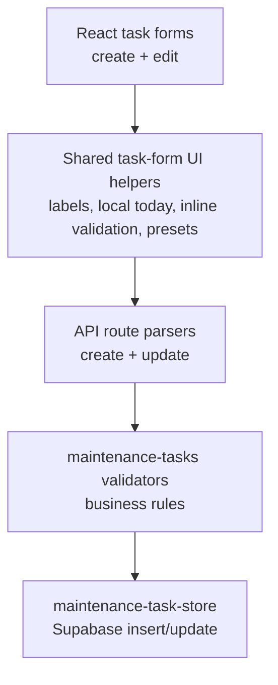

# Task Form Language and Validation Polish Implementation Plan

## Overview

Polish the S-05 task form flow so HomeKeep users can create and edit maintenance tasks with consistent language, safe date entry, and faster recurrence choices. The implementation keeps the MVP recurrence contract unchanged: recurrence is still stored and calculated as a positive whole number of days.

The work should build on the completed F-02 shadcn/Luma/Lime foundation. This is not a visual-system rebuild, a dashboard hierarchy redesign, or a data model change.

## Current State Analysis

HomeKeep already has the core task loop and validation split across UI, API routes, store, and helpers:

- `src/components/tasks/CreateTaskForm.tsx:7` renders the create form as a React form posting to `/api/tasks/create`; it uses shadcn primitives but has no local state, no default date, no max date, no recurrence presets, and no inline validation.
- `src/components/tasks/TaskList.astro:110` renders the edit form as static Astro markup posting to `/api/tasks/update`; it uses the same field names as create but does not share component logic with create.
- `src/components/tasks/TaskList.astro:110` and `src/components/tasks/TaskList.astro:161` currently repeat `id="edit-task"` and `form="edit-task"` for every task. Any edit-form rebuild must fix this with a per-task form id.
- `src/pages/api/tasks/create.ts:37` converts `recurrenceIntervalDays` with `Number(...)` and relies on store validation for invalid values; there is no exported parser or dedicated create route parser test.
- `src/pages/api/tasks/update.ts:49` exports `parseMaintenanceTaskUpdateForm`, rejects missing required values before building an update payload, then relies on store validation for invalid field values.
- `src/lib/maintenance-tasks.ts:191` and `src/lib/maintenance-tasks.ts:210` provide central write/update validation. They validate date format and positive whole-number recurrence, but they do not reject a valid date that is in the future.
- `src/lib/maintenance-task-store.ts:49` and `src/lib/maintenance-task-store.ts:77` call the shared validators before insert and update, so central validation changes protect both create and edit writes.
- `src/pages/dashboard.astro:76` displays task API failures through the dashboard alert from the `taskError` query parameter; that pattern should remain the server fallback.

The roadmap item defines the product scope: consistent "Last completed" terminology, no future last-completed dates, today as create default, common recurrence intervals, and day-based storage.

## Decisions

| Decision | Choice | Source |
| --- | --- | --- |
| Complexity | Medium; seven questions, three phases | Plan interview |
| Date source | Browser local date for input defaults and client-side max values | Plan interview |
| Server date role | Server date remains a defensive backstop for invalid/tampered submissions | Plan interview |
| Create default | Default `lastCompletedDate` to today | Plan interview |
| Edit scope | Edit form receives the same language, validation, and recurrence preset UX as create | Plan interview |
| Recurrence presets | 30, 180, and 365 days labelled as 1 month, Half a year, and 1 year | Plan interview |
| Recurrence custom value | Keep a custom positive whole-number day input | Plan interview |
| Validation feedback | Inline client-side feedback in the interactive forms | Plan interview |
| Server fallback | Generic dashboard banner if invalid data reaches an API route | Plan interview |
| Visual baseline | Use F-02 shadcn/Luma/Lime primitives and semantic theme tokens | Roadmap / AGENTS |

## Scope

### In Scope

- Shared task-form field rules for name, last-completed date, and recurrence interval.
- Browser-local date helpers for today/default/max values in React task forms.
- Central server-side validation that rejects future `lastCompletedDate` values.
- Safer create and update route parsing for missing and non-numeric recurrence values.
- Create form default date set to browser-local today.
- Matching create and edit form UI using shadcn/Base UI primitives from `src/components/ui/`.
- Recurrence preset controls for 30, 180, and 365 days plus a custom day input.
- Inline validation messages for create and edit task forms.
- Tests for helper validation and route parser fallback behavior.
- Fix the duplicate edit form id while rebuilding edit controls.

### Out of Scope

- Supabase schema changes or migrations.
- Changing persisted recurrence from days to months, named intervals, cron rules, or ISO durations.
- Changing task status calculation, next-due calculation, or the 7-day due-soon threshold.
- Reminders, prebuilt task library, shared households, roles, invites, or AI-generated schedules.
- S-06 mobile task-list-first dashboard restructuring and banner copy overhaul.
- S-07 homepage/auth/app shell redesign beyond form integration needs.
- S-08 favicon or final identity asset work.

## Architecture Approach

The final behavior should have three layers:

React owns interactive guidance and local form state. API routes own defensive parsing and generic redirects. `src/lib/maintenance-tasks.ts` owns the business validation contract so create, edit, and store writes stay consistent.

## Phase 1: Validation Contract and Route Parsers

Establish the server-authoritative rules before changing the UI.

### Changes Required:

#### 1. Future-Date Validation

**File**: `src/lib/maintenance-tasks.ts`

**Intent**: Reject valid date-only strings that are after the server's current date so task writes cannot record work as completed in the future.

**Contract**: `validateMaintenanceTaskWriteInput` and `validateMaintenanceTaskUpdateInput` must return a `lastCompletedDate` field error when a provided date is after today's server date. Keep accepted storage format as `YYYY-MM-DD`. Keep recurrence validation as positive whole-number days.

#### 2. Testable Date Boundary

**File**: `src/lib/maintenance-tasks.ts`

**Intent**: Make future-date validation deterministic in tests without changing public task calculation behavior.

**Contract**: Add the smallest helper or optional validation context needed to compare date-only strings against a testable "today". Do not change `computeNextDueDate`, `classifyMaintenanceTaskStatus`, or `buildMaintenanceTaskDisplayItems` public behavior.

#### 3. Helper Tests

**File**: `src/lib/maintenance-tasks.test.ts`

**Intent**: Lock the boundary cases around future-date rejection and existing allowed dates.

**Contract**: Cover past date, today, tomorrow, invalid date format, invalid calendar date, and non-positive recurrence. Existing validation tests should continue to pass.

#### 4. Create Route Parser

**File**: `src/pages/api/tasks/create.ts`

**Intent**: Parse create form data explicitly before calling the store so missing, blank, and non-numeric recurrence values follow the same fallback behavior as update.

**Contract**: Export a parser function for create form data. It returns a complete `MaintenanceTaskWriteInput` only when `name`, `lastCompletedDate`, and `recurrenceIntervalDays` are present and recurrence can be represented as a number; otherwise it returns `null` and the route redirects with a dashboard `taskError` fallback without calling the store. Store validation failures may continue to pass through the store error message.

#### 5. Update Route Parser Tightening

**File**: `src/pages/api/tasks/update.ts`

**Intent**: Keep update parser behavior aligned with create parser behavior and avoid passing obvious malformed recurrence values into store validation.

**Contract**: `parseMaintenanceTaskUpdateForm` should continue to return `null` for missing required fields. It should also return `null` for recurrence values that cannot be represented as a number. Store validation remains responsible for rejecting non-positive and non-integer numeric values.

#### 6. Route Tests

**File**: `src/pages/api/tasks/create.test.ts`, `src/pages/api/tasks/update.test.ts`

**Intent**: Preserve API fallback behavior and prevent parser drift between create and update.

**Contract**: Add create parser and POST tests mirroring the update route style. Extend update parser tests for non-numeric recurrence. Invalid parser output must produce dashboard `taskError` redirects and must not call the store. Create store validation failures may continue to redirect with the store error message.

### Success Criteria:

#### Automated Verification:

- `npm run test -- src/lib/maintenance-tasks.test.ts src/pages/api/tasks/create.test.ts src/pages/api/tasks/update.test.ts` passes.
- Future `lastCompletedDate` is rejected by both write and update validation.
- Create and update parser tests cover missing, blank, and non-numeric recurrence fallback.
- Existing next-due and status calculation tests still pass without changed expected values.
- `npm run lint` passes.

#### Manual Verification:

- A tampered create submission with a future date redirects back to `/dashboard` with the existing `taskError` dashboard fallback behavior.
- A tampered update submission with a future date redirects back to `/dashboard` with the existing generic task error behavior.

## Phase 2: Shared Task Form UX

Build reusable interactive task form controls so create and edit cannot drift.

### Changes Required:

#### 1. Task Form Rules

**File**: `src/components/tasks/task-form-rules.ts` or equivalent colocated helper

**Intent**: Centralize client-side field rules used by create and edit components.

**Contract**: Export helpers for browser-local today as `YYYY-MM-DD`, recurrence preset definitions, and validation for required name, non-future date, and positive whole-number recurrence days. Presets must be exactly 30, 180, and 365 days with user-facing labels 1 month, Half a year, and 1 year.

#### 2. Shared Form Fields

**File**: `src/components/tasks/TaskFormFields.tsx` or equivalent shared React component

**Intent**: Provide one shadcn/Luma field experience for create and edit forms.

**Contract**: Render `Field`, `FieldLabel`, `Input`, `Button`, and any existing shadcn primitives needed for segmented/preset controls. Use semantic token utilities only. The component should expose controlled values or form-compatible hidden/input names for `name`, `lastCompletedDate`, and `recurrenceIntervalDays`.

#### 3. Inline Validation Messages

**File**: `src/components/tasks/TaskFormFields.tsx`, `src/components/ui/field.tsx` if existing field primitives need message support

**Intent**: Show precise field-level messages before submit, matching the user's inline-only preference.

**Contract**: Inline errors must identify the invalid field, prevent normal submit while invalid, and be accessible through `aria-invalid` and `aria-describedby`. Do not add persistent dashboard query-string field state for this slice.

#### 4. Recurrence Preset Behavior

**File**: `src/components/tasks/TaskFormFields.tsx`

**Intent**: Let users quickly choose common intervals while preserving the custom days input.

**Contract**: Selecting a preset writes the same numeric value that would be posted by the custom input. If the user types a custom number not matching a preset, the custom value remains valid and no preset needs to appear selected.

#### 5. Visual Contract

**File**: task form React components and any touched Astro wrapper

**Intent**: Keep forms aligned with F-02's shadcn/Luma/Lime baseline.

**Contract**: Use `src/components/ui/*` primitives, Lucide icons where an action benefits from an icon, and semantic classes like `text-muted-foreground`, `border-border`, `bg-card`, `bg-primary`, and `ring-ring`. Do not reintroduce `bg-cosmic`, raw starter palette utilities, or bespoke rounded panels outside existing primitives.

### Success Criteria:

#### Automated Verification:

- `npm run lint` passes.
- Shared task-form helpers are imported by both create and edit task form paths.
- A search of touched task form files finds no `bg-cosmic`, raw starter palette classes, or direct `cn` package imports.

#### Manual Verification:

- Create form shows today's browser-local date by default.
- Create and edit date inputs prevent picking dates after today's browser-local date.
- Empty task name, missing date, future date, blank recurrence, non-numeric recurrence, zero recurrence, and decimal recurrence show inline errors before submit.
- Presets show 1 month, Half a year, and 1 year; selecting each posts 30, 180, and 365 respectively.
- A custom recurrence day value remains possible and understandable.

## Phase 3: Create/Edit Integration and UX Verification

Wire the shared form behavior into the real dashboard flows.

### Changes Required:

#### 1. Create Form Integration

**File**: `src/components/tasks/CreateTaskForm.tsx`, `src/pages/dashboard.astro`

**Intent**: Replace the static create form with the shared task-form controls while preserving the existing POST target and field names.

**Contract**: The form continues to post to `/api/tasks/create` with `name`, `lastCompletedDate`, and `recurrenceIntervalDays`. It defaults `lastCompletedDate` to browser-local today and uses the generic "Save task" action. Because browser-local defaults and inline validation require client-side React, `src/pages/dashboard.astro` must render the task form as a hydrated island, for example `<CreateTaskForm client:load />`.

#### 2. Edit Form Integration

**File**: `src/components/tasks/TaskList.astro`, new `src/components/tasks/EditTaskForm.tsx` if needed

**Intent**: Give each existing task the same validation, recurrence preset, and language treatment as create while preserving the details-based edit affordance unless a small React wrapper is needed.

**Contract**: Each edit form posts to `/api/tasks/update` with `taskId`, `name`, `lastCompletedDate`, and `recurrenceIntervalDays`. Existing task values seed the form. If edit controls move into a React component, the Astro wrapper must render that component as a hydrated island, for example `<EditTaskForm client:load />`, or move the whole task-list interaction into one hydrated component. Every edit form id must be unique, for example `edit-task-${task.id}`, and every external submit button must target the matching id if the button remains outside the form.

#### 3. Delete and Complete Boundaries

**File**: `src/components/tasks/TaskList.astro`

**Intent**: Avoid regressing completed M-1 task actions while touching the task card area.

**Contract**: Mark-completed and delete forms keep their existing POST targets, hidden `taskId`, and confirmation behavior. This slice should not redesign task cards beyond what is required to integrate the edit form.

#### 4. Dashboard Error Fallback

**File**: `src/pages/dashboard.astro`, task API routes

**Intent**: Preserve generic route-level fallback while using inline validation for normal UI mistakes.

**Contract**: API routes continue to redirect to `/dashboard?taskError=...` for rejected server submissions. Do not add field-specific query-string error payloads or sticky form state in this slice.

#### 5. Manual QA Notes

**File**: `context/changes/task-form-language-and-validation-polish/plan.md`

**Intent**: Leave the plan progress section ready for implementation status updates.

**Contract**: Implementation should mark Progress checkboxes as work lands, appending commit SHAs when commits are created.

### Success Criteria:

#### Automated Verification:

- `npm run test -- src/lib/maintenance-tasks.test.ts src/pages/api/tasks/create.test.ts src/pages/api/tasks/update.test.ts` passes.
- `npm run lint` passes.
- `npm run build` passes.
- `rg -n "id=\"edit-task\"|form=\"edit-task\"" src/components/tasks` returns no duplicate static edit-form targets.
- Task form React components that rely on browser-local defaults or inline validation are rendered from Astro with client hydration directives.

#### Manual Verification:

- Create a task using the default today date and the 1 month preset; the saved task shows the expected next due date and status.
- Edit an existing task using the Half a year preset; the task updates and recalculates after redirect.
- Edit an existing task using a custom recurrence value; the task updates and recalculates after redirect.
- Attempt to submit create and edit forms with a future date; the form stays on the page and shows inline date feedback.
- Task complete and delete actions still work from the task list.
- Converted form controls render cleanly on mobile and desktop in light and dark themes.

## Testing Strategy

### Automated

- Run focused Vitest coverage after Phase 1:
  `npm run test -- src/lib/maintenance-tasks.test.ts src/pages/api/tasks/create.test.ts src/pages/api/tasks/update.test.ts`
- Run `npm run lint` after every phase that touches TypeScript, TSX, Astro, or CSS.
- Run `npm run build` after Phase 3 because Astro/React integration changes are involved.
- Do not run `npm audit fix`. If dependency changes unexpectedly occur, inspect and report them instead.

### Manual

- Browser-test create and edit with presets, custom recurrence, future dates, and required-field failures.
- Smoke-test existing completed flows: create, view status, edit, mark completed, and delete.
- Check narrow mobile width and desktop width in light and dark mode.

## Risks and Mitigations

- **Risk:** Browser-local today and server today differ around midnight or timezone boundaries. **Mitigation:** UI uses browser-local today for homeowner expectation; server validation stays defensive and date-only.
- **Risk:** Moving edit from static Astro markup to React changes form submission semantics. **Mitigation:** Keep native POST forms and field names unchanged; only add React-controlled validation around the same contract.
- **Risk:** A shared form abstraction becomes too broad. **Mitigation:** Scope it only to the fields shared by create and edit: name, last completed date, recurrence days, validation, and presets.
- **Risk:** Server fallback becomes inconsistent with inline validation. **Mitigation:** Keep inline feedback for normal UI use and dashboard `taskError` redirects for invalid API submissions.
- **Risk:** Recurrence labels imply calendar-month semantics. **Mitigation:** Labels may say 1 month, Half a year, and 1 year, but values and persisted data remain 30, 180, and 365 days.

## Rollback Plan

- If Phase 3 breaks dashboard task actions, revert create/edit integration first while keeping Phase 1 server validation if tests pass.
- If React form sharing causes hydration or submit issues, keep central validation and replace only the shared form component with smaller create/edit-specific wrappers that reuse the same helpers.
- If future-date validation causes unexpected server rejects, temporarily narrow it to route-level validation while preserving tests that document the intended final contract.

## Progress

> Convention: `- [ ]` pending, `- [x]` done. Append ` - <commit sha>` when a step lands. Do not rename step titles.

### Phase 1: Validation Contract and Route Parsers

#### Automated

- [x] 1.1 `npm run test -- src/lib/maintenance-tasks.test.ts src/pages/api/tasks/create.test.ts src/pages/api/tasks/update.test.ts` passes.
- [x] 1.2 Future `lastCompletedDate` is rejected by both write and update validation.
- [x] 1.3 Create and update parser tests cover missing, blank, and non-numeric recurrence fallback.
- [x] 1.4 Existing next-due and status calculation tests still pass without changed expected values.
- [x] 1.5 `npm run lint` passes.

#### Manual

- [x] 1.6 A tampered create submission with a future date redirects back to `/dashboard` with the existing `taskError` dashboard fallback behavior.
- [x] 1.7 A tampered update submission with a future date redirects back to `/dashboard` with the existing generic task error behavior.

### Phase 2: Shared Task Form UX

#### Automated

- [ ] 2.1 `npm run lint` passes.
- [ ] 2.2 Shared task-form helpers are imported by both create and edit task form paths.
- [ ] 2.3 A search of touched task form files finds no `bg-cosmic`, raw starter palette classes, or direct `cn` package imports.

#### Manual

- [ ] 2.4 Create form shows today's browser-local date by default.
- [ ] 2.5 Create and edit date inputs prevent picking dates after today's browser-local date.
- [ ] 2.6 Empty task name, missing date, future date, blank recurrence, non-numeric recurrence, zero recurrence, and decimal recurrence show inline errors before submit.
- [ ] 2.7 Presets show 1 month, Half a year, and 1 year; selecting each posts 30, 180, and 365 respectively.
- [ ] 2.8 A custom recurrence day value remains possible and understandable.

### Phase 3: Create/Edit Integration and UX Verification

#### Automated

- [ ] 3.1 `npm run test -- src/lib/maintenance-tasks.test.ts src/pages/api/tasks/create.test.ts src/pages/api/tasks/update.test.ts` passes.
- [ ] 3.2 `npm run lint` passes.
- [ ] 3.3 `npm run build` passes.
- [ ] 3.4 `rg -n "id=\"edit-task\"|form=\"edit-task\"" src/components/tasks` returns no duplicate static edit-form targets.
- [ ] 3.5 Task form React components that rely on browser-local defaults or inline validation are rendered from Astro with client hydration directives.

#### Manual

- [ ] 3.6 Create a task using the default today date and the 1 month preset; the saved task shows the expected next due date and status.
- [ ] 3.7 Edit an existing task using the Half a year preset; the task updates and recalculates after redirect.
- [ ] 3.8 Edit an existing task using a custom recurrence value; the task updates and recalculates after redirect.
- [ ] 3.9 Attempt to submit create and edit forms with a future date; the form stays on the page and shows inline date feedback.
- [ ] 3.10 Task complete and delete actions still work from the task list.
- [ ] 3.11 Converted form controls render cleanly on mobile and desktop in light and dark themes.
