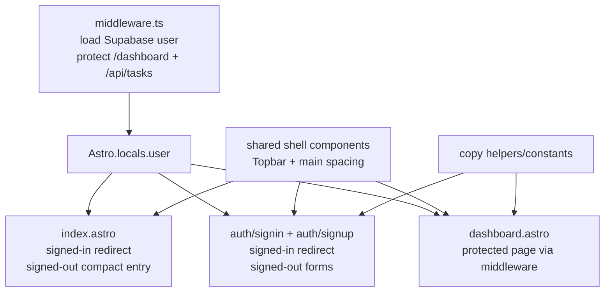

# Unified App Shell, Auth, and Homepage Implementation Plan

## Overview

Unify HomeKeep's root entry, auth pages, and dashboard shell so the app feels like one signed-in product rather than a collection of separately styled routes. Signed-in users should enter through the dashboard, signed-out users should see a compact HomeKeep entry page or auth forms, and user-facing copy should avoid implementation/vendor language.

This slice is route and shell polish only. It must not change task CRUD behavior, task calculations, Supabase schema, or the middleware ownership boundary for protected dashboard and task routes.

## Current State Analysis

The roadmap defines S-07 as the north-star polish slice for coherent entry and shell behavior:

- `context/foundation/roadmap.md:42` defines MS-04: remove implementation-focused Supabase wording from user banners.
- `context/foundation/roadmap.md:45` defines MS-07: align dashboard, auth, and homepage flows into one coherent HomeKeep app shell.
- `context/foundation/roadmap.md:72` lists `unified-app-shell-auth-and-homepage` as the S-07 roadmap item with outcome "enter HomeKeep through dashboard or auth with consistent pages and no starter-facing branding".
- `context/foundation/roadmap.md:203` through `context/foundation/roadmap.md:212` state the S-07 risk: route changes must not weaken auth protection, and middleware should keep owning protected dashboard/task routes.

The current codebase already has the foundations S-07 should reuse:

- `src/layouts/Layout.astro:1` imports global styles, configuration banners, and brand constants; the layout owns the theme pre-paint script and favicon/title defaults.
- `src/components/Topbar.astro:1` renders `AppBrand`, `ThemeToggle`, signed-in email/sign-out, and a signed-out Sign in button.
- `src/components/brand/AppBrand.astro:1` centralizes the HomeKeep brand mark/text hook.
- `src/lib/brand.ts:1` exports the HomeKeep name, title, and tagline.
- `src/middleware.ts:4` protects `"/dashboard"` and `"/api/tasks"`; `src/middleware.ts:13` sets `context.locals.user`; `src/middleware.ts:20` redirects unsigned protected-route visitors to `/auth/signin`.

The gaps are specific and visible:

- `src/pages/index.astro:2` imports `Welcome`, and `src/pages/index.astro:7` always renders it. Root does not currently redirect signed-in users to `/dashboard`.
- `src/components/Welcome.astro:12` includes `Topbar` and renders a public product-style page, but this remains a page-specific shell instead of an app-shell contract.
- `src/pages/auth/signin.astro:12`, `src/pages/auth/signup.astro:12`, and `src/pages/auth/confirm-email.astro:28` each render `Topbar` and duplicate a centered auth-card layout.
- `src/pages/auth/signin.astro:16` and `src/pages/auth/signup.astro:16` render forms even if `Astro.locals.user` is already signed in.
- `src/pages/dashboard.astro:31`, `src/pages/dashboard.astro:42`, `src/pages/dashboard.astro:51`, `src/pages/dashboard.astro:60`, and `src/pages/dashboard.astro:68` expose Supabase/provider wording in user-visible dashboard states.
- `src/lib/config-status.ts:13` and `src/lib/config-status.ts:15` expose Supabase wording in the global missing-config banner.
- `src/pages/api/auth/signin.ts:11` and `src/pages/api/auth/signup.ts:11` redirect with "Supabase is not configured"; those messages are surfaced in auth pages through `serverError`.
- `src/pages/api/auth/signin.ts:19` and `src/pages/api/auth/signout.ts:9` currently redirect to `/`, so root behavior becomes part of the post-auth navigation contract.

## Decisions

| Decision | Choice | Source |
| --- | --- | --- |
| Complexity | Medium; seven focused planning questions | Plan interview |
| Root behavior | Signed-in users redirect from `/` to `/dashboard`; signed-out users see a compact HomeKeep entry page | Plan interview |
| Auth pages when signed in | Redirect signed-in users from `/auth/signin` and `/auth/signup` to `/dashboard` | Plan interview |
| Public homepage scope | Compact product entry, not a full marketing expansion | Plan interview |
| Shell strategy | Formalize a shared shell/page layout around Topbar and consistent main spacing | Plan interview |
| Copy cleanup | Remove implementation/vendor wording from all visible normal, config, dashboard, and auth fallback messages | Plan interview |
| Signed-out Topbar | Keep signed-out Topbar minimal with Sign in only | Plan interview |
| Redirect verification | Add focused helper tests where possible, plus lint/build and manual browser checks | Plan interview |
| Auth protection boundary | Middleware continues to own protected `/dashboard` and `/api/tasks` access | Roadmap / Research |
| UI foundation | Reuse shadcn/Base UI primitives, Luma/Lime semantic tokens, and Lucide icons | AGENTS / Tech stack |

## Scope

### In Scope

- Session-aware `/` behavior: signed-in users go to `/dashboard`; signed-out users see a compact HomeKeep entry page.
- Redirect signed-in visitors away from `/auth/signin` and `/auth/signup` to `/dashboard`.
- Keep `/auth/confirm-email` available as a post-sign-up state page.
- Formalize shared shell primitives or layouts for Topbar plus consistent page/main spacing across homepage, auth pages, and dashboard.
- Preserve the existing signed-out Topbar behavior as Sign in only.
- Keep the public homepage compact and product-focused, using real HomeKeep task/status content rather than starter or generic marketing copy.
- Remove visible implementation/vendor wording from dashboard banners, missing-config banners, and auth missing-config fallback messages.
- Add focused tests for any extracted redirect/session/copy helper contracts where possible.
- Verify route behavior manually for signed-in and signed-out states.

### Out of Scope

- Supabase schema changes, migrations, storage policies, or task-store changes.
- Task create/edit/delete/complete API behavior beyond user-facing copy already surfaced by redirects.
- Maintenance-task due-date/status calculation or the 7-day due-soon threshold.
- Shared homes, roles, invites, reminders, prebuilt task library, or AI-generated schedules.
- Full visual identity work, final house-heart mark, or favicon changes owned by S-08.
- Full marketing-page expansion, pricing/features pages, README/template imagery, or acquisition copy.
- Replacing middleware with page-local auth protection.

## Architecture Approach

Keep auth state discovery centralized in the existing middleware, then make route components consume `Astro.locals.user` for entry-flow decisions. The shared shell should stay mostly presentational: layout, Topbar placement, and page spacing. Route protection remains in `src/middleware.ts`, while root/auth pages can perform session-aware redirects for usability.

## Phase 1: Route Entry Contract

Establish the route behavior before reshaping the visible shell.

### Changes Required:

#### 1. Root Auth Split

**File**: `src/pages/index.astro`

**Intent**: Make `/` the app entry point that sends signed-in homeowners directly to their task dashboard while keeping a compact public entry page for signed-out visitors.

**Contract**: If `Astro.locals.user` exists, return `Astro.redirect("/dashboard")` before rendering page content. If no user exists, render the public HomeKeep entry surface. Do not query tasks or duplicate dashboard auth protection here.

#### 2. Signed-In Auth Redirects

**File**: `src/pages/auth/signin.astro`, `src/pages/auth/signup.astro`

**Intent**: Prevent signed-in users from seeing forms that no longer apply.

**Contract**: If `Astro.locals.user` exists, redirect to `/dashboard` before rendering the auth form. Keep signed-out form behavior and `serverError` query handling unchanged.

#### 3. Confirm Email Availability

**File**: `src/pages/auth/confirm-email.astro`

**Intent**: Preserve the sign-up completion/confirmation state regardless of whether the user is already signed in in local development or in production email-confirmation flows.

**Contract**: Do not redirect away from `/auth/confirm-email` solely because a user exists unless implementation research proves the Supabase flow requires it. Keep the existing dev/prod copy split based on `import.meta.env.DEV`.

#### 4. Redirect Helper Extraction

**File**: `src/lib/auth-navigation.ts`, `src/lib/auth-navigation.test.ts`

**Intent**: Make redirect decisions testable without building a heavy Astro page test harness.

**Contract**: Export small pure helpers for route-entry decisions, such as "should root redirect to dashboard" and "should auth page redirect to dashboard". Helpers should consume minimal session shape, not Supabase clients or Astro context objects. Add focused Vitest coverage for signed-in and signed-out root/auth-page decisions.

### Success Criteria:

#### Automated Verification:

- `npm run test -- src/lib/auth-navigation.test.ts` passes.
- `npm run lint` passes.
- `rg -n 'Astro.redirect\\("/dashboard"\\)|redirect\\("/dashboard"\\)' src/pages/index.astro src/pages/auth/signin.astro src/pages/auth/signup.astro` confirms root/sign-in/sign-up signed-in redirects are present.
- `rg -n 'PROTECTED_ROUTES|"/dashboard"|"/api/tasks"' src/middleware.ts` confirms dashboard/task protection remains middleware-owned.

#### Manual Verification:

- Signed-out visit to `/` renders the public HomeKeep entry page.
- Signed-in visit to `/` redirects to `/dashboard`.
- Signed-in visit to `/auth/signin` redirects to `/dashboard`.
- Signed-in visit to `/auth/signup` redirects to `/dashboard`.
- Signed-out visit to `/auth/signin` and `/auth/signup` still renders the expected forms.
- `/auth/confirm-email` remains reachable after sign-up.

## Phase 2: Shared Shell and Compact Public Entry

Formalize the shared shell so homepage, auth, and dashboard routes stop drifting.

### Changes Required:

#### 1. Shared Page Shell

**File**: `src/layouts/Layout.astro`, new `src/components/AppShell.astro` or equivalent

**Intent**: Provide one reusable shell contract for pages that use the HomeKeep Topbar and standard main spacing.

**Contract**: The shell renders `Topbar` once, then a main content container with responsive spacing consistent with the dashboard. It should allow route-specific content width needs, such as compact auth cards and wider dashboard content. It must not own task fetching, auth mutations, or page-specific redirects.

#### 2. Auth Page Shell Adoption

**File**: `src/pages/auth/signin.astro`, `src/pages/auth/signup.astro`, `src/pages/auth/confirm-email.astro`

**Intent**: Remove duplicated Topbar/main/card centering wrappers while keeping existing forms and auth outcome content intact.

**Contract**: Auth pages use the shared shell or a small auth-shell wrapper. `SignInForm`, `SignUpForm`, `ServerError`, and `SubmitButton` behavior remain unchanged. Cards may remain as the framed auth content surface.

#### 3. Dashboard Shell Adoption

**File**: `src/pages/dashboard.astro`

**Intent**: Bring the protected dashboard into the same shell contract without changing the task list/create layout from S-06.

**Contract**: Keep server-side task loading, route query flags, `CreateTaskPanel client:load`, and `TaskList` composition. Replace only duplicated outer shell/spacing where the shared shell can do so without moving dashboard alerts or task surfaces in a behavior-changing way.

#### 4. Compact Public Entry

**File**: `src/pages/index.astro`, `src/components/Welcome.astro` or replacement component

**Intent**: Keep the signed-out homepage compact and app-oriented, not a full marketing page.

**Contract**: The public entry should use HomeKeep brand constants, shadcn/Base UI primitives, semantic Luma/Lime tokens, and app-real concepts: maintenance tasks, next due date, OK/due soon/overdue, and privacy. It should include an obvious create-account path in the page body and a sign-in path, while the Topbar remains Sign in only for signed-out visitors.

#### 5. Topbar Contract Preservation

**File**: `src/components/Topbar.astro`

**Intent**: Keep navigation simple and predictable during shell unification.

**Contract**: Signed-out Topbar shows ThemeToggle and Sign in only. Signed-in Topbar keeps email, ThemeToggle, and Sign out. Do not add page-specific Topbar action branching in this slice.

### Success Criteria:

#### Automated Verification:

- `npm run lint` passes.
- `npm run build` passes.
- `rg -n "bg-cosmic|purple-|blue-|slate-|emerald-|rose-|amber-|sky-|text-white" src/pages src/components` returns no app-UI regressions in touched files.
- `rg -n "10x Astro Starter|template|starter" src/pages src/components src/layouts` returns no user-facing starter-branding matches.
- `rg -n "Topbar" src/pages src/components` shows Topbar usage is centralized through the shared shell or intentionally limited to the shell component.

#### Manual Verification:

- Homepage, sign-in, sign-up, confirm-email, and dashboard share consistent top navigation and page spacing.
- Signed-out Topbar shows Sign in only, plus the theme toggle.
- Public homepage body still offers a clear create-account path.
- Dashboard task creation/list layout from S-06 remains intact on mobile and desktop.
- Auth forms remain centered and usable on mobile and desktop.
- Light, dark, and system themes render all unified shell surfaces cleanly.

## Phase 3: User-Facing Copy and Final Route QA

Remove implementation/vendor wording from visible messages and verify the full app-entry loop.

### Changes Required:

#### 1. Dashboard Alert Copy

**File**: `src/pages/dashboard.astro`

**Intent**: Replace provider-oriented task success copy with user-facing language.

**Contract**: `taskCreated`, `taskCompleted`, `taskDeleted`, and `taskUpdated` alerts should confirm the user-visible outcome without saying Supabase or referring to backend data sync. Preserve the same query parameter contracts.

#### 2. Missing Configuration Copy

**File**: `src/lib/config-status.ts`, `src/components/Banner.astro` if needed

**Intent**: Make missing app configuration visible without surfacing provider/scaffold wording to end users.

**Contract**: Visible banner text should say the app is not fully configured and auth/data features may be unavailable. It should not say Supabase in the user-facing message. Keep enough code-level naming or docs metadata for developers to diagnose setup, but do not link users to starter-branded documentation from a production-facing banner.

#### 3. Auth Fallback Copy

**File**: `src/pages/api/auth/signin.ts`, `src/pages/api/auth/signup.ts`

**Intent**: Remove provider-specific fallback errors surfaced in auth forms.

**Contract**: Missing configuration redirects should use generic user-facing messages such as "Sign in is temporarily unavailable." and "Account creation is temporarily unavailable." Preserve existing redirects, form field names, and Supabase auth calls.

#### 4. Post-Auth Redirect Sanity

**File**: `src/pages/api/auth/signin.ts`, `src/pages/api/auth/signout.ts`

**Intent**: Keep post-auth navigation coherent after root becomes session-aware.

**Contract**: Sign-in may continue redirecting to `/` if root then redirects signed-in users to `/dashboard`, or it may redirect directly to `/dashboard`. Sign-out may continue redirecting to `/` so signed-out users see the compact entry page. Avoid redirect loops.

#### 5. Final Verification Notes

**File**: `context/changes/unified-app-shell-auth-and-homepage/plan.md`

**Intent**: Keep implementation progress mechanical and auditable.

**Contract**: Progress checkboxes are updated only in the `## Progress` section. When commits are created, append the short commit SHA to completed items.

### Success Criteria:

#### Automated Verification:

- `npm run test -- src/lib/auth-navigation.test.ts` passes.
- `npm run lint` passes.
- `npm run build` passes.
- `rg -n "latest data from Supabase|Supabase is not configured|10x-astro-starter|10x Astro Starter" src/pages src/components src/lib` returns no user-facing matches. Remaining type names/imports such as `MaintenanceTaskSupabaseClient` are allowed because they are source-only.
- `rg -n 'taskCreated|taskCompleted|taskDeleted|taskUpdated|taskError' src/pages/dashboard.astro` confirms query contracts are still present.

#### Manual Verification:

- Full signed-out loop: `/` -> sign up -> confirm-email -> sign in remains understandable.
- Full signed-in loop: sign in -> dashboard -> `/` redirects to dashboard.
- Signed-in auth-page visits redirect to dashboard without loops.
- Sign out returns to the compact public entry page.
- Missing-config banner and auth fallback messages are user-facing and provider-neutral.
- Dashboard task success messages confirm the outcome without implementation wording.
- Mobile and desktop screenshots show no overlapping text or unstable controls on homepage, auth pages, and dashboard shell.

## Testing Strategy

### Automated

- Run focused helper tests after Phase 1:
  `npm run test -- src/lib/auth-navigation.test.ts`
- Run `npm run lint` after every phase that touches Astro/React/TypeScript.
- Run `npm run build` after Phase 2 and Phase 3 because route/layout behavior changes are involved.
- Use `rg` checks for old palette utilities, starter strings, visible provider wording, and preserved query/route contracts.

### Manual

- Browser-test signed-out and signed-in behavior for `/`, `/auth/signin`, `/auth/signup`, `/auth/confirm-email`, and `/dashboard`.
- Check sign in and sign out navigation for redirect loops.
- Check mobile and desktop layouts for homepage, auth cards, and dashboard shell.
- Check light, dark, and system themes after shell adoption.
- If local Supabase config is missing, verify fallback copy is user-facing and generic.

## Risks and Mitigations

- **Risk:** Root/auth redirects create loops after sign in or sign out. **Mitigation:** Keep redirect decisions small, test pure helper logic, and manually verify signed-in/signed-out loops.
- **Risk:** Page-local redirects weaken the protected-route model. **Mitigation:** Leave `/dashboard` and `/api/tasks` protection in middleware; page redirects only improve entry behavior.
- **Risk:** Shared shell adoption accidentally moves task surfaces or regresses S-06 mobile hierarchy. **Mitigation:** Keep dashboard task composition unchanged and verify `CreateTaskPanel` plus `TaskList` placement after shell changes.
- **Risk:** Removing provider wording makes local setup failures harder to diagnose. **Mitigation:** Use generic visible messages while preserving code-level config names and developer-oriented diagnostics outside user-facing copy.
- **Risk:** Homepage scope expands into marketing work. **Mitigation:** Keep it compact, app-specific, and tied to PRD concepts rather than adding broad feature sections.

## Rollback Plan

- If redirects cause loops or confusion, revert Phase 1 route redirects while keeping shell/copy changes that pass lint/build.
- If shared shell adoption breaks dashboard layout, revert dashboard shell adoption first and keep auth/homepage shell cleanup.
- If copy cleanup obscures developer setup diagnosis, revise missing-config wording to include a generic support/setup hint without restoring provider/scaffold branding.
- If build fails from extracted helper imports, fix the helper import path or helper signature before proceeding so the focused redirect tests stay part of this slice.

## Progress

> Convention: `- [ ]` pending, `- [x]` done. Append ` - <commit sha>` when a step lands. Do not rename step titles.

### Phase 1: Route Entry Contract

#### Automated

- [x] 1.1 `npm run test -- src/lib/auth-navigation.test.ts` passes. — 4505d48
- [x] 1.2 `npm run lint` passes. — 4505d48
- [x] 1.3 `rg -n 'Astro.redirect\\("/dashboard"\\)|redirect\\("/dashboard"\\)' src/pages/index.astro src/pages/auth/signin.astro src/pages/auth/signup.astro` confirms root/sign-in/sign-up signed-in redirects are present. — 4505d48
- [x] 1.4 `rg -n 'PROTECTED_ROUTES|"/dashboard"|"/api/tasks"' src/middleware.ts` confirms dashboard/task protection remains middleware-owned. — 4505d48

#### Manual

- [x] 1.5 Signed-out visit to `/` renders the public HomeKeep entry page. — 4505d48
- [x] 1.6 Signed-in visit to `/` redirects to `/dashboard`. — 4505d48
- [x] 1.7 Signed-in visit to `/auth/signin` redirects to `/dashboard`. — 4505d48
- [x] 1.8 Signed-in visit to `/auth/signup` redirects to `/dashboard`. — 4505d48
- [x] 1.9 Signed-out visit to `/auth/signin` and `/auth/signup` still renders the expected forms. — 4505d48
- [x] 1.10 `/auth/confirm-email` remains reachable after sign-up. — 4505d48

### Phase 2: Shared Shell and Compact Public Entry

#### Automated

- [x] 2.1 `npm run lint` passes.
- [x] 2.2 `npm run build` passes.
- [x] 2.3 `rg -n "bg-cosmic|purple-|blue-|slate-|emerald-|rose-|amber-|sky-|text-white" src/pages src/components` returns no app-UI regressions in touched files.
- [x] 2.4 `rg -n "10x Astro Starter|template|starter" src/pages src/components src/layouts` returns no user-facing starter-branding matches.
- [x] 2.5 `rg -n "Topbar" src/pages src/components` shows Topbar usage is centralized through the shared shell or intentionally limited to the shell component.

#### Manual

- [x] 2.6 Homepage, sign-in, sign-up, confirm-email, and dashboard share consistent top navigation and page spacing.
- [x] 2.7 Signed-out Topbar shows Sign in only, plus the theme toggle.
- [x] 2.8 Public homepage body still offers a clear create-account path.
- [x] 2.9 Dashboard task creation/list layout from S-06 remains intact on mobile and desktop.
- [x] 2.10 Auth forms remain centered and usable on mobile and desktop.
- [x] 2.11 Light, dark, and system themes render all unified shell surfaces cleanly.

### Phase 3: User-Facing Copy and Final Route QA

#### Automated

- [ ] 3.1 `npm run test -- src/lib/auth-navigation.test.ts` passes.
- [ ] 3.2 `npm run lint` passes.
- [ ] 3.3 `npm run build` passes.
- [ ] 3.4 `rg -n "latest data from Supabase|Supabase is not configured|10x-astro-starter|10x Astro Starter" src/pages src/components src/lib` returns no user-facing matches. Remaining type names/imports such as `MaintenanceTaskSupabaseClient` are allowed because they are source-only.
- [ ] 3.5 `rg -n 'taskCreated|taskCompleted|taskDeleted|taskUpdated|taskError' src/pages/dashboard.astro` confirms query contracts are still present.

#### Manual

- [ ] 3.6 Full signed-out loop: `/` -> sign up -> confirm-email -> sign in remains understandable.
- [ ] 3.7 Full signed-in loop: sign in -> dashboard -> `/` redirects to dashboard.
- [ ] 3.8 Signed-in auth-page visits redirect to dashboard without loops.
- [ ] 3.9 Sign out returns to the compact public entry page.
- [ ] 3.10 Missing-config banner and auth fallback messages are user-facing and provider-neutral.
- [ ] 3.11 Dashboard task success messages confirm the outcome without implementation wording.
- [ ] 3.12 Mobile and desktop screenshots show no overlapping text or unstable controls on homepage, auth pages, and dashboard shell.
